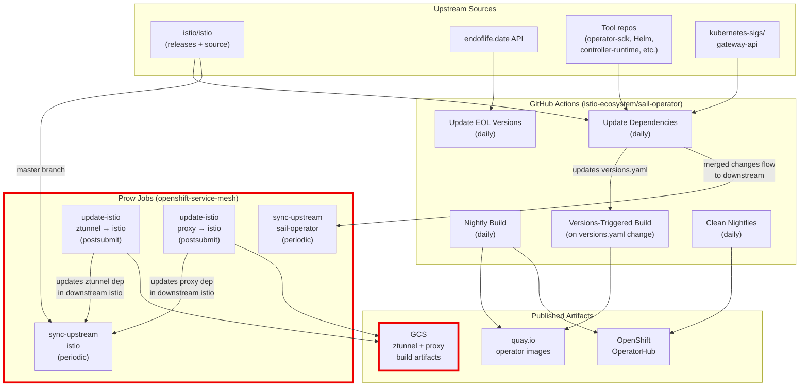
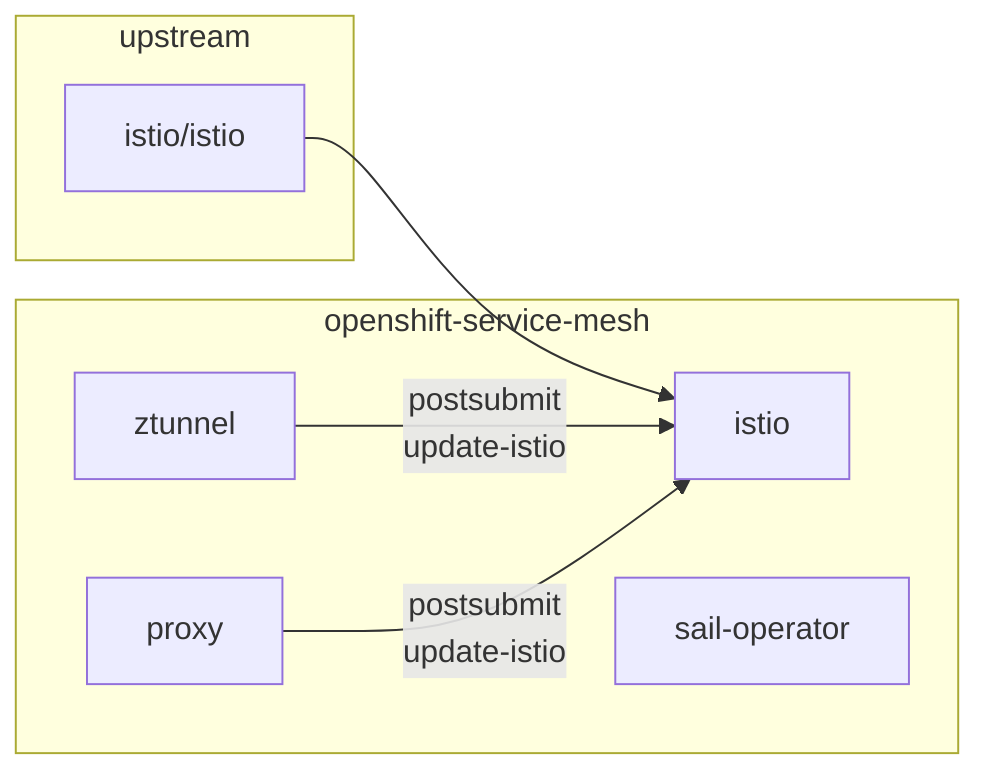

# OpenShift Service Mesh

Repositories for building OpenShift Service Mesh (OSSM) for the [OpenShift
Container Platform][ocp].

> [!NOTE]
> For general information about service mesh concepts click [here].

> [!WARNING]
> This organization deals *only* with builds of the 3.x series of OSSM.

[here]:https://www.redhat.com/en/topics/microservices/what-is-a-service-mesh
[ocp]:https://www.redhat.com/en/technologies/cloud-computing/openshift/container-platform

## About

OpenShift Service Mesh (OSSM) is based on [Istio] and tries to follow that
upstream project very closely.

The repositories you find here will generally be up to date with the upstream
Istio repositories, with some small changes mainly related to building and
shipping releases. In the repositories section we'll provide a brief overview of
some of the repositories in this org to help you get started.

> [!NOTE]
> Ultimately **this organization is meant for OSSM developers, not
> users**. If you're a user looking to install and use OSSM, see the [OpenShift
> Container Platform Documentation][ocp-docs] for your version instead.

[Istio]:https://github.com/istio
[ossm-istio]:https://github.com/openshift-service-mesh/istio
[ocp-docs]:https://docs.redhat.com/en/documentation/openshift_container_platform/

## Development

The vast majority of development of OpenShift Service Mesh (OSSM) happens in
[upstream Istio] (importantly this includes the [Sail Operator], which is at the
center of how we deploy and manage the lifecycle of Istio), the most notable
exceptions being some areas related to [Envoy Proxy] (which are deployed as
sidecars to [Pods] within the mesh to control and shape traffic (See the [Istio
Architecture] documentation for more details) or other building and testing
configurations specific to OSSM. So as a developer on OSSM, you'll _mostly_ be
following the pattern of **"develop in upstream, build in downstream"**.

> [!NOTE]
> The most notable caveat to our pure upstream focus is that upstream
> Istio employs a version of [Envoy Proxy] that uses [BoringSSL], which is
> notably not compliant with the United States [National Institute of Standards
> and Technology (NIST)][nist]'s [Federal Information Processing Standards
> (FIPS)][fips]. In order to ensure that OpenShift users have FIPS compliant
> service mesh connectivity, we maintain and utilize the alternative
> [envoyproxy/envoy-openssl][alt] which uses [OpenSSL] instead.

In the following sections we'll provide some steps which contain guidance on how
to go from just starting to actively developing and building Istio, and getting
involved with the community. In later sections we'll also cover some of the
notable areas where we have OSSM specific tooling in the repositories.

[upstream Istio]:https://github.com/istio/istio
[Sail Operator]:https://github.com/istio-ecosystem/sail-operator
[Envoy Proxy]:https://github.com/envoyproxy
[Pods]:https://kubernetes.io/docs/concepts/workloads/pods/
[Istio Architecture]:https://istio.io/latest/docs/ops/deployment/architecture/
[BoringSSL]:https://www.envoyproxy.io/docs/envoy/latest/faq/build/boringssl
[nist]:https://www.nist.gov
[fips]:https://www.nist.gov/standardsgov/compliance-faqs-federal-information-processing-standards-fips
[alt]:https://github.com/envoyproxy/envoy-openssl
[OpenSSL]:https://www.openssl.org/

### Step 1: First things first!

If you're unfamiliar with Istio in general, it can be worthwhile to use and
experiment with it prior to trying to develop for it. We strongly recommend you
check out the [main Istio documentation][istio-docs] and specifically work
through some of the working [examples] provided there as deploying and
experimenting with those can help you more quickly understand how Istio works
and help illuminate some of the components involved.

[istio-docs]:https://istio.io/latest/docs/
[examples]:https://istio.io/latest/docs/examples/

### Step 2: Istio development practices

We recommend all new developers start by reading the [Preparing for Istio
Development Wiki][wiki-dev-prep]. This will provide some insights into where
things are and how to get started. After you've familiarized yourself with the
basics, check out the [General Istio Wiki][wiki] for guidance on other specific
subjects.

[wiki-dev-prep]:https://github.com/istio/istio/wiki/Preparing-for-Development
[wiki]:https://github.com/istio/istio/wiki

### Step 3: Getting involved in the Istio community

Development documentation is **not be-all and end-all** for an aspiring Istio
developer. Istio is a [community driven] project, and so to be a successful
Istio developer (and therefore OSSM developer as well) you *inherently need to
be engaged with the Istio upstream development ecosystem*. After reading through
the wikis and trying some things out yourself, go [get involved]!

[community driven]:https://github.com/istio/community/
[get involved]:https://istio.io/latest/get-involved/

## Repositories

Most of development and some testing happens entirely in [upstream Istio]. That
being said, there are a few places in the repositories you'll find here in this
org where OpenShift specific patches or build tooling can be found, which we
will provide some notes on.

[upstream Istio]:https://github.com/istio

### openshift-service-mesh/istio

First and foremost, we have a fork of the main Istio repository which you'll
find at [openshift-service-mesh/istio][ossm-istio]. Largely this is kept up to
date with [upstream istio/istio][istio], but you will find some small fixes
(many relating to timeouts) which enable us to run the [upstream integration
tests][integration] on OpenShift CI. Look in the `prow/` directly for scripts
specifically related to running integration tests for OSSM.

We maintain an auto-generated [table of downstream patches](../downstream-changes/istio.md). You can add context to each commit by modifying the YAML files in the [downstream-changes](../downstream-changes/) directory. For each commit, you can use the `comment`, `upstreamPR` and `isPermanent` fields to add information to the tables. The `upstreamPR` field should link to any istio/istio Pull Request that contains this (or a similar) commit, while the `comment` field should be used to give additional context like "this commit can be replaced by upstream feature `xyz` starting from upstream version 1.44". If a change has to be carried over permanently (e.g. because it does not make sense to move it upstream), then you should set `isPermanent` to `true` to mark it. Remember: our goal is to minimize the amount of downstream patches we maintain, so for every commit we need to capture information on why it has to exist downstream rather than upstream.

[ossm-istio]:https://github.com/openshift-service-mesh/istio
[istio]:https://github.com/istio/istio
[integration]:https://github.com/istio/istio/tree/master/tests/integration

### openshift-service-mesh/sail-operator

It's important to note that in addition to the regular upstream Istio org there
is also an [Istio Ecosystem] organization which houses projects that relate to
or enhance Istio. Notably there is a [Kubernetes operator] in this organization
called [istio-ecosystem/sail-operator][sail] which is key to how Istio is
deployed and managed on OpenShift clusters. We keep a fork of this at
[openshift-service-mesh/sail-operator][ossm-sail] which is mostly 1:1 with the
upstream, but notably there's an `ossm/` directory added related which relates
to OpenShift specific build options.

[Istio Ecosystem]:https://github.com/istio-ecosystem/
[Kubernetes operator]:https://www.redhat.com/en/topics/containers/what-is-a-kubernetes-operator
[sail]:https://github.com/istio-ecosystem/sail-operator
[ossm-sail]:https://github.com/openshift-service-mesh/sail-operator

### openshift-service-mesh/proxy

Upstream Istio includes the [istio/proxy][proxy] repository which provides
Istio-specific options over [Envoy Proxy]. For OpenShift we wrap this repository
as well in [openshift-service-mesh/proxy][ossm-proxy]. Most of the differences
you'll find from upstream here relate to integrating our alternative
[envoyproxy/envoy-openssl][alt] (which is necessary for [FIPS] compliance).

[proxy]:https://github.com/istio/proxy
[ossm-proxy]:https://github.com/openshift-service-mesh/proxy
[Envoy Proxy]:https://github.com/envoyproxy
[alt]:https://github.com/envoyproxy/envoy-openssl
[FIPS]:https://www.nist.gov/standardsgov/compliance-faqs-federal-information-processing-standards-fips

### openshift-service-mesh/ztunnel

Istio provides [Ambient Mode] as an alternative to sidecar mode for service mesh.
This mode uses a per-node L4 proxy, and an optional L7 proxy (instead of sidecar
proxies). The L7 proxy is Envoy, and is called a "waypoint proxy". The L4 proxy
used is [istio/ztunnel]. We have a downstream build of this proxy at
[openshift-service-mesh/ztunnel]. We added OpenSSL support to ztunnel to support
[FIPS].

[Ambient Mode]:https://istio.io/latest/docs/ambient/
[istio/ztunnel]:https://github.com/istio/ztunnel
[openshift-service-mesh/ztunnel]:https://github.com/openshift-service-mesh/ztunnel
[FIPS]:https://www.nist.gov/standardsgov/compliance-faqs-federal-information-processing-standards-fips

## Downstream Sync (OpenShift CI / Prow)

Prow jobs in the [openshift/release](https://github.com/openshift/release) repository automate syncing and dependency updates across the OSSM forks. Upstream Sail Operator has its own sync jobs you can read about [here](https://github.com/istio-ecosystem/sail-operator/blob/main/SYNC.md).

### Prow job types

- **Periodic jobs** run on a cron schedule (weekdays only), independent of any PR. Used for upstream sync (`sync-upstream`) and scheduled test suites.
- **Presubmit jobs** run when a PR is opened or updated, before it merges. Used for build validation and testing (e.g., `cargo-build`, `unit`, `envoy`).
- **Postsubmit jobs** run after a PR merges into a branch. Used for artifact publishing (`copy-artifacts-gcs`, `cargo-build-and-push`) and cross-repo dependency updates (`update-istio`).

All sync and update jobs use `maistra/test-infra` automator tooling and create PRs with `auto-merge` and `tide/merge-method-merge` labels so they merge automatically via Tide.

### Downstream Prow jobs

| Repo | Type | Purpose |
| ---- | ---- | ------- |
| sail-operator | Periodic | Merges each upstream `istio-ecosystem/sail-operator` branch into the corresponding downstream branch (e.g. `release-1.28` → `release-3.3`), keeping downstream forks up to date with upstream changes plus any downstream-specific patches. |
| istio | Periodic | Merges upstream `istio/istio` master into downstream master. Only master is synced automatically; release branches have CI jobs but no periodic sync. |
| ztunnel | Postsubmit | No periodic sync. When a PR merges into a release branch, builds ztunnel, uploads artifacts to [GCS](https://storage.googleapis.com/maistra-prow-testing/ztunnel), and creates a PR to update the ztunnel dependency in the matching `openshift-service-mesh/istio` release branch. |
| proxy | Postsubmit | No periodic sync. When a PR merges into a release branch, uploads build artifacts to [GCS](https://storage.googleapis.com/maistra-prow-testing/proxy), and creates a PR to update the proxy dependency in the matching `openshift-service-mesh/istio` release branch. |

### How the pieces fit together

The sync and update jobs form a pipeline across repos. When upstream Istio changes flow downstream, this is the typical sequence:

- **Sail-operator** syncs upstream-to-downstream on a schedule (periodic).
- **Istio** syncs upstream master on a schedule (periodic), and also receives dependency update PRs from ztunnel and proxy postsubmit jobs.
- **Ztunnel** has no periodic sync; all branches push updates to istio on merge (postsubmit).
- **Proxy** has no periodic sync; all branches push updates to istio on merge (postsubmit).

### Key differences from the upstream sync jobs

- The upstream jobs (GitHub Actions) update dependencies, tool versions, and Istio versions _within_ the upstream repo.
- The downstream periodic jobs merge the _results_ of those upstream changes into the downstream forks, along with any downstream-specific patches already on the downstream branches.
- The downstream postsubmit jobs propagate build artifacts and dependency references _across_ downstream forks (ztunnel/proxy → istio).

